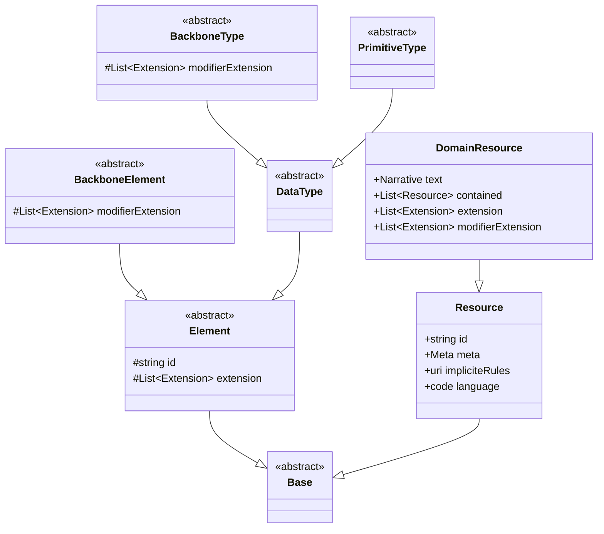

# FHIR Type Framework

[Mermaid Docs](https://mermaid.js.org/intro/)

**Refer to [FHIR Type Framework](https://hl7.org/fhir/R5/types.html)**

```mermaid
classDiagram

  class Base
  <<abstract>> Base

  class Element
  <<abstract>> Element
    Element : #string id
    Element : #List~Extension~ extension
  Element --|> Base

  class BackboneElement
  <<abstract>> BackboneElement
  BackboneElement : #List~Extension~ modifierExtension
  BackboneElement --|> Element

  class DataType
  <<abstract>> DataType
  DataType --|> Element

  class BackboneType
  <<abstract>> BackboneType
    BackboneType : #List~Extension~ modifierExtension
  BackboneType --|> DataType

  class PrimitiveType
  <<abstract>> PrimitiveType
  PrimitiveType --|> DataType

  class Resource
    Resource : +string id
    Resource : +Meta meta
    Resource : +uri impliciteRules
    Resource : +code language
  Resource --|> Base

  class DomainResource
    DomainResource : +Narrative text
    DomainResource : +List~Resource~ contained
    DomainResource : +List~Extension~ extension
    DomainResource : +List~Extension~ modifierExtension
  DomainResource --|> Resource

```
