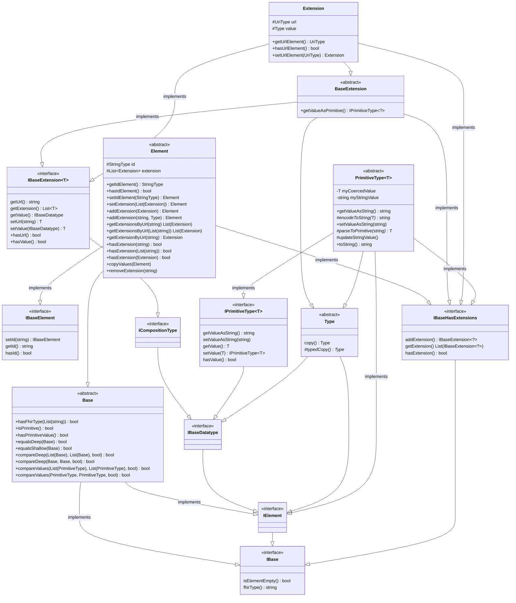

# HAPI FHIR Low Level Hierarchies

[Mermaid Docs](https://mermaid.js.org/intro/)

**Refer to [design-note.md](design-notes.md): "General References" -> "HAPI FHIR" -> "Package Links"**

```mermaid
classDiagram

  class Base
  <<abstract>> Base
    Base : +hasFhirType(List(string)) bool
    Base : +isPrimitive() bool
    Base : +hasPrimitiveValue() bool
    Base : +equalsDeep(Base) bool
    Base : +equalsShallow(Base) bool
    Base : +compareDeep(List(Base), List(Base), bool) bool
    Base : +compareDeep(Base, Base, bool) bool
    Base : +compareValues(List(PrimitiveType), List(PrimitiveType), bool) bool
    Base : +compareValues(PrimitiveType, PrimitiveType, bool) bool
    %% Add other HAPI FHIR Base methods as needed
  Base --|> IBase : implements
  Base --|> IElement : implements

  class IBase
  <<interface>> IBase
    IBase : isElementEmpty() bool
    IBase : fhirType() string

  class IElement
  <<interface>> IElement
  IElement --|> IBase

  class IBaseElement
  <<interface>> IBaseElement
    IBaseElement : setId(string) IBaseElement
    IBaseElement : getId() string
    %% Added from Element
    IBaseElement : hasId() bool

  class IBaseDatatype
  <<interface>> IBaseDatatype
  IBaseDatatype --|> IElement

  class ICompositionType
  <<interface>> ICompositionType
  ICompositionType --|> IBaseDatatype

  class IBaseExtension~T~
  <<interface>> IBaseExtension
    IBaseExtension : getUrl() string
    IBaseExtension : getExtension() List~T~
    IBaseExtension : getValue() IBaseDatatype
    IBaseExtension : setUrl(string) T
    IBaseExtension : setValue(IBaseDatatype) T
    %% Added from Extension
    IBaseExtension : +hasUrl() bool
    IBaseExtension : +hasValue() bool

  IBaseExtension --|> ICompositionType

  class IBaseHasExtensions
  <<interface>> IBaseHasExtensions
    IBaseHasExtensions : addExtension() IBaseExtension~?~
    IBaseHasExtensions : getExtension() List(IBaseExtension~?~)
    IBaseHasExtensions : hasExtension() bool
  IBaseHasExtensions --|> IBase

  class Element
  <<abstract>> Element
    Element : #StringType id
    Element : #List~Extension~ extension
    Element : +getIdElement() StringType
    Element : +hasIdElement() bool
    Element : +setIdElement(StringType) Element
    Element : +setExtension(List(Extension)) Element
    Element : +addExtension(Extension) Element
    Element : +addExtension(string, Type) Element
    Element : +getExtensionsByUrl(string) List(Extension)
    Element : +getExtensionsByUrl(List(string)) List(Extension)
    Element : +getExtensionByUrl(string) Extension
    Element : +hasExtension(string) bool
    Element : +hasExtension(List(string)) bool
    Element : +hasExtension(Extension) bool
    Element : +copyValues(Element)
    Element : +removeExtension(string)
    %% Add other HAPI FHIR Element methods as needed
  Element --|> Base
  Element --|> IBaseHasExtensions : implements
  Element --|> IBaseElement : implements

  class IPrimitiveType~T~
  <<interface>> IPrimitiveType
    IPrimitiveType : getValueAsString() string
    IPrimitiveType : setValueAsString(string)
    IPrimitiveType : getValue() T
    IPrimitiveType : setValue(T) IPrimitiveType~T~
    IPrimitiveType : hasValue() bool
  IPrimitiveType --|> IBaseDatatype

  class Type
  <<abstract>> Type
    Type : copy() Type
    Type : #typedCopy()* Type
  Type --|> IBaseDatatype
  Type --|> IElement

  class BaseExtension
  <<abstract>> BaseExtension
    BaseExtension : +getValueAsPrimitive() IPrimitiveType~?~
  BaseExtension --|> Type
  BaseExtension --|> IBaseExtension : implements
  BaseExtension --|> IBaseHasExtensions : implements

  class Extension
    Extension : #UriType url
    Extension : #Type value
    Extension : +getUrlElement() UriType
    Extension : +hasUrlElement() bool
    Extension : +setUrlElement(UriType) Extension
  Extension --|> BaseExtension
  Extension --|> IBaseExtension : implements
  Extension --|> IBaseHasExtensions : implements

  class PrimitiveType~T~
  <<abstract>> PrimitiveType
    PrimitiveType : -T myCoercedValue
    PrimitiveType : -string myStringValue
    PrimitiveType : +getValueAsString() string
    PrimitiveType : #encodeToString(T)* string
    PrimitiveType : +setValueAsString(string)
    PrimitiveType : #parseToPrimitive(string)* T
    PrimitiveType : #updateStringValue()
    PrimitiveType : +toString() string
  PrimitiveType --|> Type
  PrimitiveType --|> IPrimitiveType~T~ : implements
  PrimitiveType --|> IBaseHasExtensions : implements
  PrimitiveType --|> IElement : implements
  %%PrimitiveType <|-- Base64BinaryType
  %%PrimitiveType <|-- BaseDateTimeType
  %%PrimitiveType <|-- BooleanType
  %%PrimitiveType <|-- CanonicalType
  %%PrimitiveType <|-- CodeType
  %%PrimitiveType <|-- DateTimeType
  %%PrimitiveType <|-- DateType
  %%PrimitiveType <|-- DecimalType
  %%PrimitiveType <|-- Enumeration
  %%PrimitiveType <|-- IdType
  %%PrimitiveType <|-- InstantType
  %%PrimitiveType <|-- IntegerType
  %%PrimitiveType <|-- MarkdownType
  %%PrimitiveType <|-- OidType
  %%PrimitiveType <|-- PositiveIntType
  %%PrimitiveType <|-- StringType
  %%PrimitiveType <|-- TimeType
  %%PrimitiveType <|-- UnsignedIntType
  %%PrimitiveType <|-- UriType
  %%PrimitiveType <|-- UrlType
  %%PrimitiveType <|-- UuidType

```
